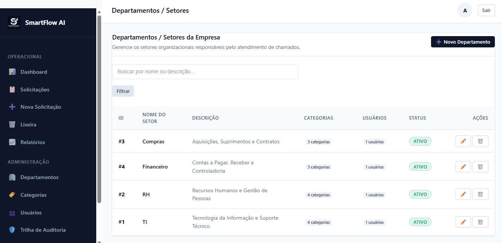

<div align="center">

# 🚀 SmartFlow AI

### Sistema Web de Gestão de Solicitações Internas

Aplicação web desenvolvida para centralizar, organizar e acompanhar solicitações entre departamentos de uma organização.

**PHP • MySQL/MariaDB • JavaScript • Bootstrap • MVC • GitHub Actions • Linux**

</div>

---

## 📌 Sobre o Projeto

O **SmartFlow AI** é um sistema web de gestão de solicitações internas desenvolvido para centralizar demandas entre diferentes departamentos de uma empresa.

A aplicação permite registrar, direcionar, acompanhar e concluir solicitações em um ambiente único, proporcionando maior **organização, rastreabilidade, segurança e controle das demandas internas**.

O projeto contempla desde o desenvolvimento da aplicação e modelagem do banco de dados até autenticação, regras de negócio, auditoria, relatórios e publicação em ambiente de produção.

> 🔐 O código-fonte principal é mantido em repositório privado. Este repositório público apresenta a documentação e a demonstração visual do projeto para fins de portfólio.

---

## 🎯 Problema

Em muitas organizações, solicitações internas são realizadas por diferentes canais, como mensagens, e-mails ou conversas informais.

Esse modelo pode dificultar:

- o acompanhamento das demandas;
- a identificação do responsável;
- a definição de prioridades;
- o histórico das solicitações;
- a geração de indicadores;
- a rastreabilidade das alterações.

O **SmartFlow AI** foi desenvolvido para centralizar esse processo.

---

## 💡 Solução

A aplicação fornece um ambiente centralizado no qual usuários autenticados podem abrir solicitações para outros departamentos e acompanhar seu andamento.

O sistema organiza as demandas considerando:

- departamento de origem;
- departamento responsável;
- categoria;
- prioridade;
- solicitante;
- responsável pelo atendimento;
- status;
- data de abertura.

A solução foi estruturada inicialmente para os departamentos:

**💻 TI • 👥 RH • 🛒 Compras • 💰 Financeiro**

---

# 📸 Demonstração do Sistema

## 🔐 Autenticação

O SmartFlow AI possui acesso autenticado, impedindo que funcionalidades internas sejam utilizadas por usuários não autorizados.


---

## 📊 Dashboard Gerencial

O dashboard apresenta uma visão consolidada das solicitações registradas no sistema.

É possível acompanhar indicadores como:

- total de demandas;
- solicitações abertas;
- solicitações em andamento;
- solicitações concluídas;
- taxa de conclusão;
- distribuição das demandas por departamento;
- evolução temporal;
- demandas prioritárias pendentes.


---

## 🎫 Fila de Solicitações

A fila centraliza as solicitações e permite visualizar informações importantes para o atendimento.

As demandas podem ser consultadas por:

- prioridade;
- categoria;
- departamento responsável;
- status;
- período;
- palavra-chave ou ID.

A organização da fila considera a prioridade das solicitações e a ordem de abertura.


---

## ➕ Abertura de Nova Solicitação

Usuários autenticados podem registrar novas solicitações e direcioná-las ao departamento responsável.

Durante a abertura são informados dados como:

- departamento de origem;
- título;
- departamento responsável;
- categoria;
- prioridade;
- descrição detalhada.


---

## 🗑️ Lixeira e Soft Delete

O sistema utiliza o conceito de **Soft Delete**.

Isso significa que registros excluídos não são imediatamente removidos fisicamente do banco de dados.

Essa abordagem contribui para:

- preservação do histórico;
- rastreabilidade;
- possibilidade de restauração;
- segurança operacional.


---

## 📈 Relatórios e Consultas

O módulo de relatórios permite analisar as solicitações utilizando diferentes filtros.

Entre os recursos disponíveis estão:

- indicadores por status;
- filtros por departamento;
- filtros por categoria;
- filtros por prioridade;
- filtros por período;
- consulta dos registros;
- exportação para CSV.

> A demonstração visual completa deste módulo utiliza somente dados de teste no ambiente de portfólio.

---

## 🏢 Gestão de Departamentos

Administradores podem gerenciar os departamentos responsáveis pelas solicitações.

Cada departamento pode possuir suas próprias categorias e operadores associados.



---

## 🏷️ Gestão de Categorias

As categorias permitem classificar as solicitações de acordo com o departamento responsável.

Exemplos:

**TI**
- Suporte a Hardware e Periféricos
- Redes e Acesso à Internet
- Sistemas Corporativos
- Acessos, E-mails e Senhas

**RH**
- Férias e Licenças
- Benefícios
- Folha de Pagamento

**Financeiro**
- Contas a Pagar
- Contas a Receber
- Reembolso de Despesas

**Compras**
- Aquisição de Equipamentos
- Cotação de Serviços
- Suprimentos


---

## 👥 Gestão de Usuários

O sistema possui diferentes perfis de acesso.

### 👑 Administrador

Possui acesso administrativo e pode:

- gerenciar usuários;
- gerenciar departamentos;
- gerenciar categorias;
- acompanhar solicitações;
- consultar auditoria;
- acessar configurações administrativas.

### 👤 Operador

É associado a um departamento e pode, de acordo com suas permissões:

- abrir solicitações;
- acompanhar demandas;
- assumir solicitações;
- realizar atendimentos;
- atualizar o andamento das demandas.

Por segurança e privacidade, imagens contendo dados identificáveis de usuários não são disponibilizadas publicamente neste portfólio.

---

## 🛡️ Trilha de Auditoria

O SmartFlow AI possui uma trilha de auditoria para registrar eventos importantes realizados na aplicação.

O histórico permite rastrear ações como:

- criação de usuários;
- criação de solicitações;
- atribuição de responsáveis;
- alteração de status;
- conclusão de solicitações;
- atualização de senha;
- outras alterações relevantes.

Os registros de auditoria foram projetados para preservar a rastreabilidade das operações.

> A captura completa da auditoria não é disponibilizada publicamente neste portfólio para evitar exposição de dados identificáveis utilizados durante os testes.

---

## ⚙️ Configurações Globais

O sistema possui uma área administrativa para configuração de parâmetros globais.

Entre os parâmetros implementados estão:

- identidade visual;
- logotipo da aplicação;
- nome da aplicação;
- tempo limite de sessão;
- limite de registros para exportação CSV;
- retenção de logs;
- governança dos registros de erro e segurança.


---

# ✨ Principais Funcionalidades

- 🔐 Autenticação de usuários
- 🔑 Troca obrigatória de senha no primeiro acesso
- 👤 Controle de acesso por perfil
- 🏢 Gestão de departamentos
- 🏷️ Gestão de categorias
- 🎫 Criação de solicitações
- ⚡ Priorização de demandas
- 🔄 Controle de status
- 👨‍💻 Atribuição de responsáveis
- 📊 Dashboard gerencial
- 🔎 Filtros e consultas
- 📈 Relatórios
- 📤 Exportação CSV
- 🗑️ Soft Delete
- ♻️ Restauração de registros
- 🛡️ Trilha de auditoria
- ⏱️ Controle de sessão por inatividade
- ⚙️ Configurações administrativas

---

# 🛠️ Tecnologias Utilizadas

## 💻 Backend

- **PHP 8.2**
- Arquitetura **MVC**
- **PDO**
- Programação orientada à organização em Models, Views e Controllers

## 🗄️ Banco de Dados

- **MySQL / MariaDB**
- Relacionamentos entre entidades
- Integridade referencial
- Sistema de migrations
- Seeds para dados iniciais

## 🎨 Frontend

- **HTML5**
- **CSS3**
- **JavaScript**
- **Bootstrap 5**

## ⚙️ DevOps e Infraestrutura

- **Git**
- **GitHub**
- **GitHub Actions**
- **SSH**
- **Linux**
- Deploy automatizado
- Ambiente de produção

---

# 🏗️ Arquitetura da Aplicação

O projeto utiliza uma organização baseada no padrão **MVC (Model-View-Controller)**.

```text
                 USUÁRIO
                    │
                    ▼
               NAVEGADOR
                    │
                    ▼
              SMARTFLOW AI
                    │
           ┌────────┴────────┐
           │                 │
           ▼                 ▼
      CONTROLLERS          VIEWS
           │
           ▼
     REGRAS DE NEGÓCIO
           │
           ▼
         MODELS
           │
           ▼
        PDO / SQL
           │
           ▼
    MYSQL / MARIADB
```

Essa separação facilita a organização do código e a manutenção das responsabilidades da aplicação.

---

# 🗄️ Estrutura de Dados

O sistema gerencia entidades relacionadas ao funcionamento das solicitações, incluindo:

```text
Usuários
   │
   ├── Perfis
   └── Departamentos
            │
            └── Categorias
                    │
                    ▼
               Solicitações
                    │
          ┌─────────┴─────────┐
          ▼                   ▼
     Responsável          Auditoria
```

Também existe controle de configurações da aplicação e migrations do banco de dados.

---

# 🔐 Segurança

Durante o desenvolvimento foram implementadas práticas de segurança como:

- armazenamento seguro de senhas utilizando hash;
- verificação segura de credenciais;
- consultas preparadas utilizando PDO;
- proteção contra CSRF;
- validação de dados no backend;
- escape de saída contra XSS;
- controle de acesso baseado em perfil;
- gerenciamento de sessões;
- cookies de sessão protegidos;
- expiração de sessão por inatividade;
- proteção dos arquivos de configuração;
- credenciais fora do repositório Git;
- trilha de auditoria;
- Soft Delete para preservação do histórico.

---

# 🔄 Banco de Dados e Migrations

O SmartFlow AI possui um sistema de migrations responsável por controlar a criação e evolução da estrutura do banco de dados.

O processo permite identificar quais migrations já foram executadas e aplicar somente as pendentes.

Exemplo do fluxo:

```text
Aplicação
    │
    ▼
Migration Runner
    │
    ├── Verifica migrations executadas
    │
    ├── Identifica migrations pendentes
    │
    ▼
Executa alterações
    │
    ▼
MySQL / MariaDB
```

Isso facilita a preparação e atualização do banco em diferentes ambientes.

---

# 🚀 CI/CD e Deploy

Além do desenvolvimento da aplicação, foi configurado um fluxo de publicação utilizando **GitHub Actions e SSH**.

```text
DESENVOLVIMENTO LOCAL
        │
        ▼
       GIT
        │
        ▼
      GITHUB
        │
        ▼
  GITHUB ACTIONS
        │
        ▼
       SSH
        │
        ▼
  SERVIDOR LINUX
        │
        ▼
    SMARTFLOW AI
```

O processo automatiza o envio dos arquivos necessários para o ambiente de produção.

Arquivos sensíveis, credenciais e configurações específicas do servidor não são enviados ao repositório público.

---

# 🌐 Aplicação em Produção

O SmartFlow AI possui uma versão funcional publicada na web.

### 🔗 Acessar aplicação

https://jessicafontes.alwaysdata.net/

> 🔐 Por se tratar de uma aplicação corporativa, as funcionalidades internas exigem autenticação.

> As credenciais administrativas não são disponibilizadas publicamente.

---

# 🧪 Ambiente de Demonstração

As imagens apresentadas neste portfólio representam funcionalidades reais da aplicação utilizando dados criados para testes e demonstração.

Informações sensíveis, credenciais e dados que possam identificar usuários reais não devem ser publicados neste repositório.

---

# 🧠 Evoluções Futuras

A estrutura do projeto também foi pensada considerando futuras evoluções.

Entre as possibilidades estão:

- 🤖 classificação inteligente de solicitações;
- 🧠 triagem utilizando Inteligência Artificial;
- 💬 sugestões automáticas para operadores;
- 📊 análise inteligente do histórico de demandas;
- 🔎 utilização de dados estruturados para identificação de padrões;
- ☁️ evolução da infraestrutura de hospedagem.

> As funcionalidades de Inteligência Artificial representam possibilidades futuras e **não fazem parte da versão atual do sistema**.

---

# 📚 Conhecimentos Aplicados

O desenvolvimento do SmartFlow AI envolveu conhecimentos de:

`PHP` `MySQL` `MariaDB` `JavaScript` `HTML5` `CSS3` `Bootstrap` `MVC` `PDO` `SQL` `Git` `GitHub` `GitHub Actions` `Linux` `SSH` `CI/CD` `Segurança Web` `Modelagem de Dados`

Além da implementação técnica, o projeto envolveu definição de:

- requisitos;
- regras de negócio;
- perfis e permissões;
- fluxo de solicitações;
- modelagem de banco de dados;
- segurança;
- testes;
- preparação do ambiente;
- publicação em produção.

---

# 📂 Sobre este Repositório

Este é o **repositório público de portfólio do SmartFlow AI**.

O código-fonte da aplicação é mantido separadamente em um repositório privado.

O objetivo deste repositório é apresentar:

- contexto do problema;
- solução desenvolvida;
- funcionalidades;
- decisões técnicas;
- arquitetura;
- tecnologias;
- segurança;
- infraestrutura;
- demonstração visual.

---

<div align="center">

## 👩‍💻 Desenvolvido por Jéssica Fontes

**Análise e Desenvolvimento de Sistemas**

**Software Development • Cloud Computing • Artificial Intelligence**

Projeto desenvolvido para fins de estudo, prática e construção de portfólio profissional.

</div>
